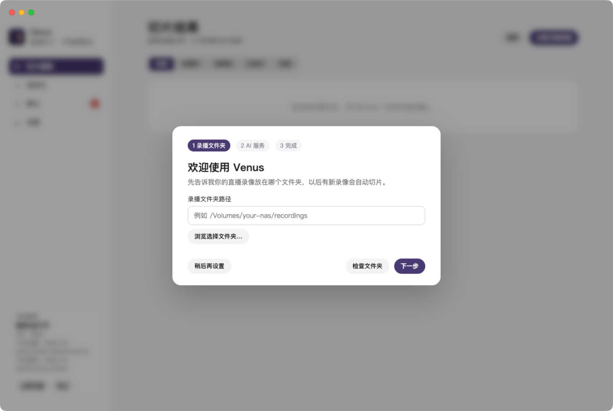
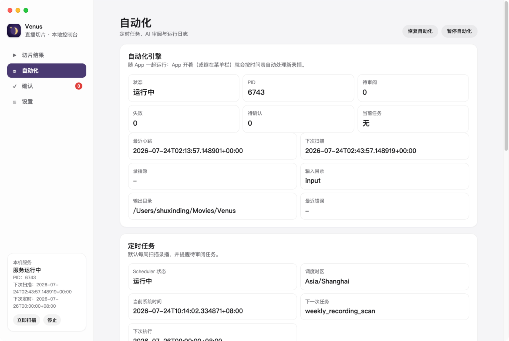
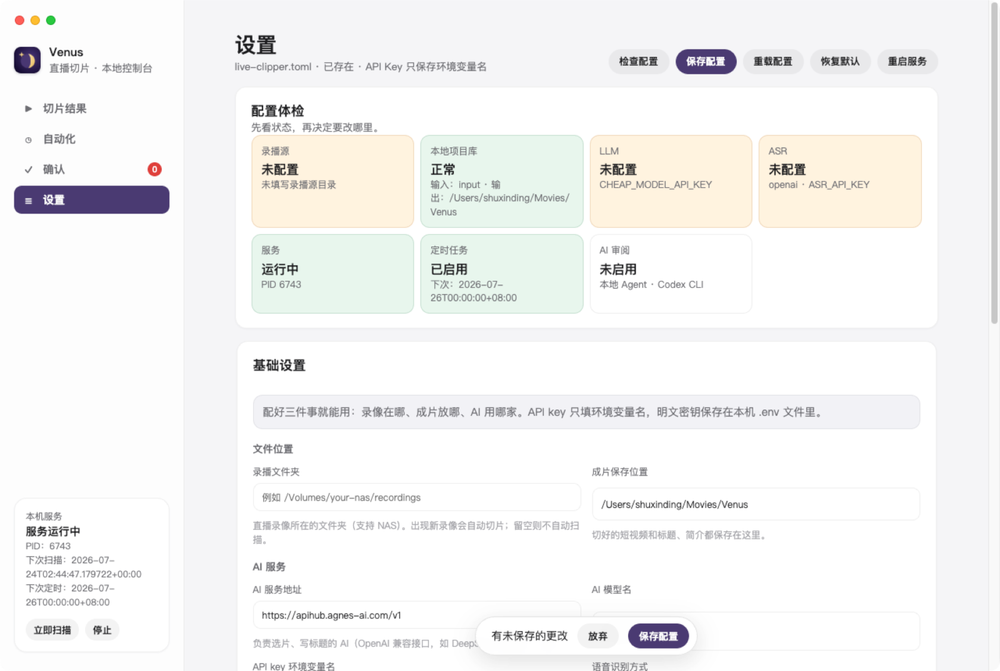

# Venus

**Turn a long livestream into a set of reviewable, publish-ready short videos.**

Venus is a macOS app for streamers and content teams. It finds recordings, transcribes speech, helps AI identify useful moments, creates subtitles, and renders short videos from one local workspace.

[Download the latest release](https://github.com/dingshuxin353/live-clipper/releases/latest) · [中文主文档](../README.md) · [Advanced usage](advanced-usage.md)

## Why Venus

- Bring recording discovery, transcription, review, subtitles, and rendering into one app.
- Review AI-selected candidates before publishing.
- Download a local speech model for offline transcription.
- Scan local or mounted NAS recording folders on a schedule.
- Keep original videos, intermediate files, and exports in directories you choose.

## Interface

| Automation center | Local speech models |
| :---: | :---: |
|  |  |

## From a livestream to short videos

### 1. Find recordings

Choose a recording folder on your Mac or a mounted NAS. Scan it manually or on a schedule.

### 2. Transcribe speech

Use a downloaded local model or a speech recognition service you configure to create timestamped text.

### 3. Review with AI

Analyze the transcript and identify moments worth publishing with a local Agent or a compatible model service.

### 4. Render clips

Create subtitled short videos, inspect the results in Venus, and decide what to publish.

Local transcription does not mean AI review is fully offline. Network use for AI review depends on the Agent or model service you select.

## Features

### Clips and review

- See processing, needs-review, rendered, and failed tasks.
- Start AI review and inspect its latest result.
- Open rendered clips and task details.

### Automation

- Schedule scans for new recordings.
- Inspect scheduled jobs, AI review status, and logs.
- AI review is never enabled silently; you must configure it.

### Models and services

- Download, inspect, and remove local speech models.
- Choose ModelScope (recommended in mainland China) or Hugging Face (official international source).
- Configure speech recognition and AI review separately.

### Settings and safety

- Configure recording and export folders, services, and automation.
- Use layered basic and advanced settings.
- Route deletion and cleanup through confirmation and path checks.

## Quick start

1. Download and install Venus.
2. Choose recording and export folders.
3. Choose and download a local speech model, or configure a cloud ASR service.
4. Configure how AI review should run.
5. Return to Clip Results and select “Scan recordings now.”

Local speech models are available in Small (about 187 MB), Medium (about 489 MB), and Large (about 1.6 GB). Onboarding initially selects Small to reduce the first download cost, not as a quality recommendation. The first download requires a network connection; transcription can run offline afterward. AI review may still use the network, depending on your configuration.

## Download

Venus currently supports Apple Silicon Macs running macOS 14 or later.

1. Open [GitHub Releases](https://github.com/dingshuxin353/live-clipper/releases/latest).
2. Download the latest arm64 `.dmg`.
3. Open the DMG and drag Venus to Applications.
4. Launch Venus and complete onboarding.

Official builds are signed with Apple Developer ID, notarized by Apple, and support in-app updates. Intel Mac, Windows, and Linux clients are not currently promised.

## Local processing and privacy

Original videos, intermediate files, transcripts, and rendered clips are stored locally by default. Local ASR does not send audio to a cloud ASR provider. Cloud ASR sends audio to the service you configure, while cloud AI review sends the transcript context needed for its decision. Logs hide model request bodies by default.

Read the complete [privacy notes](privacy.md).

## Documentation

- [Chinese README — canonical product documentation](../README.md)
- [Advanced usage](advanced-usage.md)
- [Configuration](configuration.md)
- [Troubleshooting](troubleshooting.md)
- [MCP workbench guide](mcp-workbench-user-guide.md)
- [Contributing](../CONTRIBUTING.md)
- [MIT License](../LICENSE)
