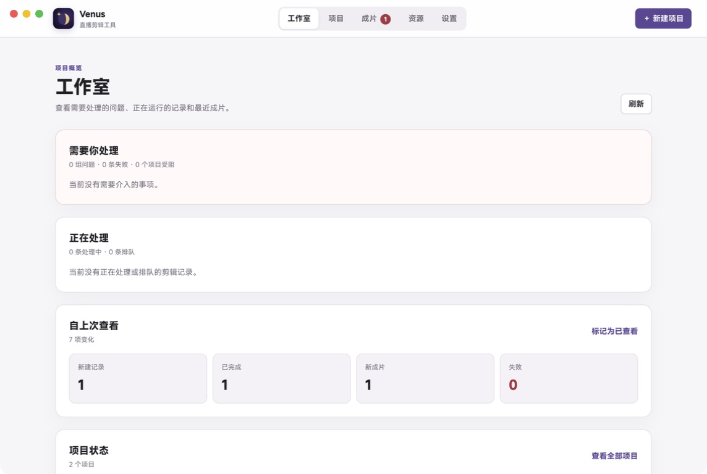
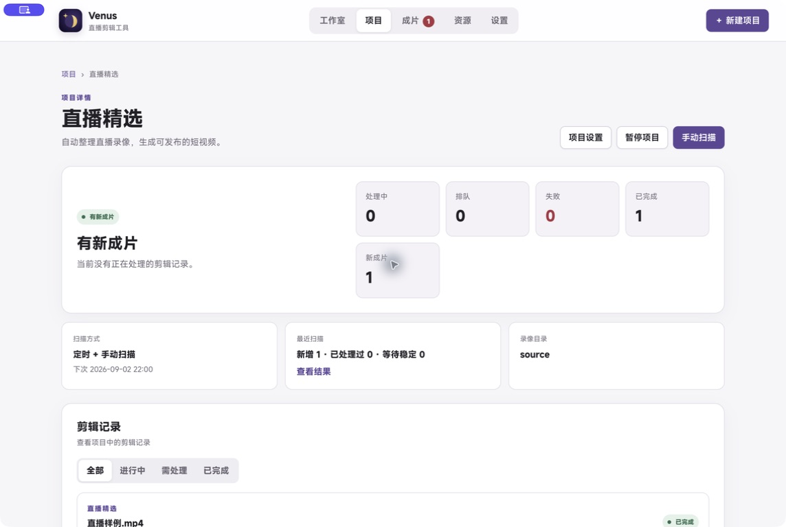
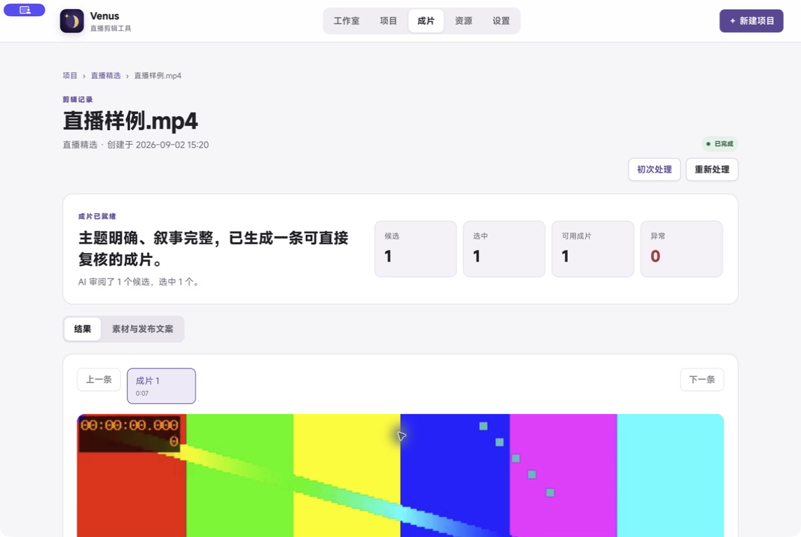

# Venus

**Organize long livestream recordings into short videos you can inspect, recover, and process again.**

Venus is a macOS app for streamers and content teams. It keeps recording sources, processing history, rendered clips, and recovery actions together in project workspaces.

[Download the latest release](https://github.com/dingshuxin353/live-clipper/releases/latest) · [中文主文档](../README.md) · [Advanced usage](advanced-usage.md)

## The 1.0.0 desktop flow

```text
First-time setup or a safe upgrade
  → Create or open a project
  → Find recordings manually or on a schedule
  → Transcribe, analyze, review with AI, and render automatically
  → Inspect clips, AI decisions, and publishing material
  → Fix issues or reprocess a recording
```

Each project has its own recording source, output folder, and processing history. Venus identifies recordings by content, so renaming or copying a file does not create duplicate work. Reprocessing creates a new version while keeping earlier results available for comparison.

## Upgrading from 0.3.x

On first launch, Venus checks existing data and creates a backup before migration. The writable workbench stays closed until the upgrade finishes. If migration fails, the old data and completed backup remain available for another attempt or diagnosis. Migration does not delete original recordings.

New installations open first-time setup. Choose speech recognition, configure the AI service, and create the first project before entering the studio.

## Interface



| Project processing history | Clips and AI decisions |
| :---: | :---: |
|  |  |

The screenshots use isolated sample data and contain no real projects, file paths, or credentials.

## What Venus does

- **Project workbench:** create, pause, and resume projects; inspect each recording's processing stage, recent scans, and queue state.
- **Automatic processing:** find stable recordings manually or on a schedule, then transcribe, analyze, review with AI, subtitle, and render them.
- **Clips and publishing material:** play rendered clips and inspect the AI decision, title, description, and other saved material.
- **Recovery:** issues explain what was affected and what to do next; processing can continue after the required resource is restored.
- **Reprocessing:** start a new version from the original recording, change processing settings, and compare results without overwriting an earlier version.
- **Local file boundaries:** work copies, intermediate files, and clips stay in directories you choose; scans, upgrades, and reprocessing do not modify original recordings.

## Quick start

1. Download and install Venus from [GitHub Releases](https://github.com/dingshuxin353/live-clipper/releases/latest).
2. Complete first-time setup, or follow the in-app check, backup, and upgrade steps for 0.3.x data.
3. Create or open a project and confirm its recording source and output folder.
4. Scan for recordings manually, or enable scheduled scans in Settings.
5. Open Clips to inspect the video, AI decision, and publishing material. Follow the issue page when a resource needs attention, or reprocess the recording with different settings.

Local speech models are available in Small (about 187 MB), Medium (about 489 MB), and Large (about 1.6 GB), from ModelScope (recommended in mainland China) or Hugging Face (official international source). The first download requires a network connection. Local speech recognition can run offline after the model is installed, but AI review may still use the network through the configured AI service.

## Download

Venus currently supports Apple Silicon Macs running macOS 14 or later.

1. Open [GitHub Releases](https://github.com/dingshuxin353/live-clipper/releases/latest).
2. Download the latest arm64 `.dmg`.
3. Open the DMG and drag Venus to Applications.
4. Launch Venus and complete onboarding.

Official builds are signed with Apple Developer ID, notarized by Apple, and support in-app updates. Intel Mac, Windows, and Linux clients are not currently promised.

## Local processing and privacy

Original videos, intermediate files, transcripts, and rendered clips are stored locally by default. Local ASR does not send audio to a cloud ASR provider. Cloud ASR sends audio to the service you configure, while cloud AI review sends the transcript context needed for its decision. Logs hide model request bodies by default.

Read the complete [privacy notes](privacy.md).

## Documentation

- [Chinese README — canonical product documentation](../README.md)
- [Advanced usage](advanced-usage.md)
- [Configuration](configuration.md)
- [Troubleshooting](troubleshooting.md)
- [MCP workbench guide](mcp-workbench-user-guide.md)
- [Contributing](../CONTRIBUTING.md)
- [MIT License](../LICENSE)
