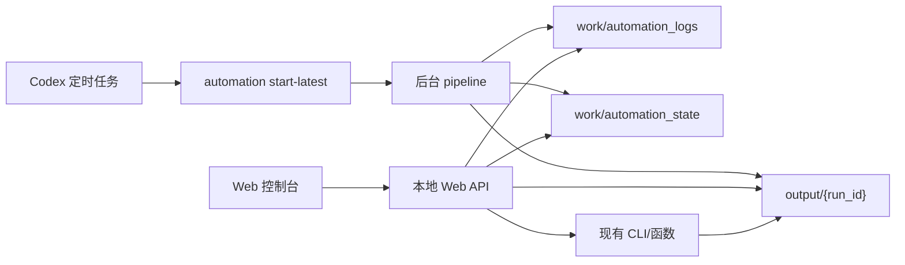

# Live Clipper Web 控制台设计

日期：2026-06-21

## 背景

`live-clipper` 的命令行流程已经能完成从 NAS 录像复制、本地 ASR、Agnes 候选扫描、Agnes 复评、Codex 选片、渲染到清理的闭环。现在的问题不是核心流程缺失，而是使用体验仍然依赖终端日志和手动判断。

第一版 Web 控制台的目标是让用户在本机浏览器里快速了解每次任务的进度、结果和需要介入的节点，并能触发少量安全操作。它不是公开视频管理平台，也不是完整审片工具。

## 决策

选择 **方案 B：本地轻量 Web 服务**。

通过新增 `live-clipper web` 启动一个只监听本机的 Web 服务，提供只读状态 API 和少量操作 API。前端是一个本地工作台界面，通过 API 读取 `output/`、`work/automation_state/`、`work/automation_logs/` 里的状态，不直接接管长时间运行的流水线。

## 用户与使用场景

第一版只服务单人本机使用：

- 访问方式：`http://127.0.0.1:<port>`
- 默认不开放局域网访问
- 不做登录、账号、权限、多用户协作
- 不暴露给客户或公网

典型场景：

1. 周日凌晨 Codex 自动化启动后台流水线。
2. 用户早上打开 Web 控制台，看最新任务是否完成候选生成。
3. 如果任务需要 Codex，页面明确展示任务文件、下一步和相关产物。
4. Codex 选片后，用户可在页面点击渲染。
5. 渲染完成后，用户可先预演清理，再确认删除本地大文件。

## 范围

第一版包含：

- 任务列表
- 单任务详情
- 当前阶段和进度展示
- 日志尾部查看
- 产物文件状态
- Codex 介入提示
- 触发 `automation check`
- 触发渲染
- 触发清理预演
- 触发清理确认

第一版不包含：

- 网页内候选片段审阅和精剪
- 视频时间线编辑器
- 多用户登录
- 远程访问
- 数据库
- 完整任务队列系统
- 替代 Codex 的自动选片逻辑

## 产品结构

### 任务列表

左侧展示所有 `output/*` 任务目录。每个任务条目展示：

- 任务名或录像名
- 当前阶段
- 是否正在运行
- 是否需要 Codex
- 候选数量
- 入选数量
- 成片数量
- 是否可清理

任务状态优先从以下来源合并：

- `run_report.json`
- `run_metadata.json`
- `work/automation_state/{run_id}.json`
- `work/automation_logs/{run_id}.log`
- 任务目录下实际存在的文件

### 任务详情

中间主区域展示选中任务：

- 顶部状态摘要：阶段、下一步、运行状态、PID、开始时间、更新时间
- 流程进度条：发现录像、本地复制、ASR、Agnes 粗扫、Agnes 复评、Codex 选片、渲染、清理
- 产物列表：`codex_brief.json`、`refined_candidates.json`、`selected_clips.json`、`clips/*.mp4`、`run_report.json`
- 操作按钮：检查状态、渲染、清理预演、确认清理

### 右侧辅助区

右侧展示：

- 日志尾部
- Codex 任务提示
- 失败摘要
- 清理预演结果

当 `requires_codex=true` 时，页面应突出显示需要介入的原因和任务文件路径。

## 视觉方向

风格选择：**内容制作工作台为主，Agnes 流程价值为辅**。

设计原则：

- 第一屏就是工作台，不做营销页
- 暗灰背景，不使用纯黑
- 信息密度中等，偏视频制作工具而不是传统运维后台
- 使用低饱和青绿或蓝绿作为主状态色
- Agnes 相关步骤用轻量品牌标签标注，例如 `Agnes 粗扫`、`Agnes 复评`
- 不做大面积渐变、装饰插画或卡片堆叠
- 卡片半径控制在 8px 以内
- 操作按钮使用明确图标和中文标签
- 日志区域使用等宽字体，保留足够行高

界面应让用户快速回答：

- 现在是否正常？
- 需要我或 Codex 做什么？
- 成片在哪里？
- 本地大文件能不能删？

## 架构

### 后端

新增轻量本地 Web 层，建议使用 FastAPI 或 Flask。选择标准是少依赖、启动快、容易测试。若项目当前依赖中没有 Web 框架，优先选择 Flask，降低复杂度。

后端职责：

- 扫描任务目录
- 读取状态 JSON
- 读取日志尾部
- 包装现有 CLI 函数
- 执行短操作
- 启动渲染等可能较长但明确的任务
- 返回结构化错误

后端不负责：

- 长时间常驻监控 Agnes 请求
- 重新实现流水线状态机
- 存储业务数据库
- 直接修改 NAS 原始文件

### 前端

第一版可以是服务端静态文件加少量 JavaScript，也可以使用轻量前端构建。为了快速落地，建议先做无构建或极少构建版本：

- `GET /` 返回单页工作台
- 浏览器定时轮询 API
- 本地状态存在内存中
- 操作按钮调用 POST API

如果后续要做审片工作台，再迁移到 React 或类似框架。

## API 设计

第一版 API：

```text
GET  /api/runs
GET  /api/runs/{run_id}
GET  /api/runs/{run_id}/log
POST /api/automation/check
POST /api/runs/{run_id}/render
POST /api/runs/{run_id}/cleanup-preview
POST /api/runs/{run_id}/cleanup-confirm
```

### GET /api/runs

返回所有任务摘要。

字段：

- `run_id`
- `run_dir`
- `phase`
- `next_step`
- `requires_codex`
- `running`
- `clip_count`
- `candidate_count`
- `selected_count`
- `updated_at`

### GET /api/runs/{run_id}

返回单任务详情，包含文件状态、自动化状态、流程步骤、可执行操作。

### GET /api/runs/{run_id}/log

返回日志尾部。默认返回最近 200 行，避免一次性加载大日志。

### POST /api/automation/check

调用现有 `check_automation_runs`，刷新任务状态和 Codex 任务文件。

### POST /api/runs/{run_id}/render

当 `selected_clips.json` 存在且 clips 未生成时，调用现有渲染函数。第一版可以同步执行并阻塞请求；如果实际渲染时间过长，再改为后台进程。

### POST /api/runs/{run_id}/cleanup-preview

调用清理预演，只返回计划，不删除文件。

### POST /api/runs/{run_id}/cleanup-confirm

调用确认清理。必须满足：

- `selected_clips.json` 存在
- 至少有一个 `clips/*.mp4`
- 清理目标只包含本地 input 副本或中间音频
- 不删除 NAS 原始文件

## 数据流



## 错误处理

错误展示要对用户可行动：

- NAS 不存在：提示检查挂载路径
- 没有录像：提示当前时间窗口未发现稳定视频
- 后台任务运行中：展示 PID 和日志路径
- Agnes 失败：展示日志尾部和建议重试
- 缺少 `selected_clips.json`：禁用渲染按钮
- 未渲染成片：禁用确认清理按钮
- 清理目标包含受保护路径：阻止确认清理

所有危险操作都要有预演或禁用条件。第一版不需要复杂弹窗，但确认清理按钮必须展示将删除的文件列表。

## 安全边界

- 默认只监听 `127.0.0.1`
- 不读取 `.env` 内容
- 不在页面展示 API key
- 不提供任意 shell 命令执行
- API 只允许操作 `output/` 和受控的本地任务目录
- 清理 API 不允许删除 NAS 原始文件

## 测试计划

后端测试：

- 能列出已有 run
- 能识别 `requires_codex`
- 能读取日志尾部
- 缺文件时返回可读错误
- 渲染按钮在缺少 `selected_clips.json` 时拒绝
- 清理预演不删除文件
- 清理确认不会删除 NAS 原始文件

前端测试：

- 空状态可读
- 运行中任务显示正确
- 需要 Codex 的任务高亮
- 失败任务展示日志尾部
- 操作按钮根据状态启用或禁用
- 移动窄屏至少能查看任务列表和详情

手工验收：

- 启动 `live-clipper web`
- 打开 localhost
- 能看到历史任务和当前任务
- 能看到后台流水线日志
- 能触发 `automation check`
- 能完成渲染和清理预演
- 确认清理只删除本地大文件

## 实施顺序

1. 抽出任务聚合层：把 `output/`、automation state、日志合并成统一 run view。
2. 增加本地 Web API。
3. 增加单页前端。
4. 接入渲染和清理按钮。
5. 补测试。
6. 用真实 NAS 任务和已有历史任务做验收。

## 成功标准

第一版完成后，用户不看终端也能知道：

- 当前任务是否还在运行
- 处理到了哪一步
- 是否需要 Codex
- 失败原因在哪里
- 成片是否已经生成
- 本地大文件是否可以安全删除
